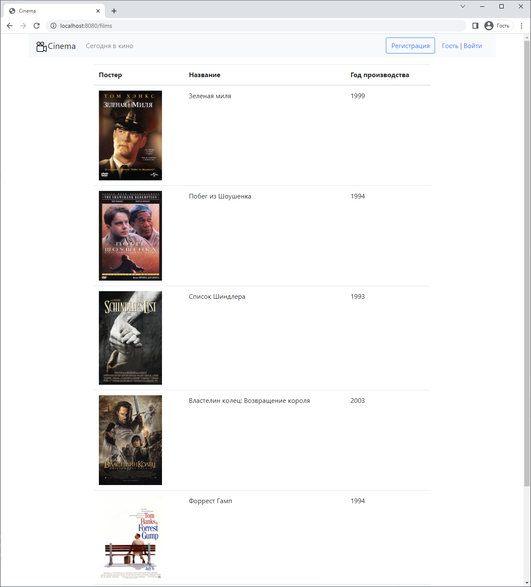

# Сервис - Кинотеатр

## Общее описание:

Сайт по покупке билетов в кинотеатре.

***

## Реализовано:
* Регистрация/Вход
* Вывод фильмов
* Покупка/выбор билетов
* Вывод купленных билетов

***

## Технологии:

***

## Запуск проекта:
* maven install
* java -jar target/job4j_cinema-1.0.jar
* Перейти по ссылке http://localhost:8080/films

***

## Структура сайта:

### Главная страница
Список всех фильмов, которые показывают в кинотеатре. Не зарегистрированные пользователи так же могут просматривать.

### Страница фильма.

### Страница выбора места в зале.
Могут выбирать только зарегистрированные пользователи.

### Информация о приобретаемом билете
Страница подробной информации о билете с возможностью его купить. Одновременно могут выбрать этот сеанс несколько человек, но продажа пройдет только у первого.

### Страница купленных билетов
После покупки билетов перенаправляет в список купленных билетов купивший зарегистрированный пользователь.

### Ошибка покупки билета.
Если билет ранее был уже куплен, то об этом будет уведомление.

### Страница регистрации.
Проверка валидации ввода.

### Ошибка регистрации.
Если пользователь уже есть с такой почтой, то об этом будет уведомление.

### Страница авторизации.
Проверка валидации ввода.

### Ошибка авторизации.
Если введены не верные учётные данные, то об этом будет уведомление.

### Добавление фильма.
Администратор сайта может добавлять фильмы в базу данных через форму. 

